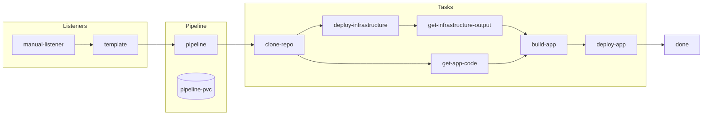
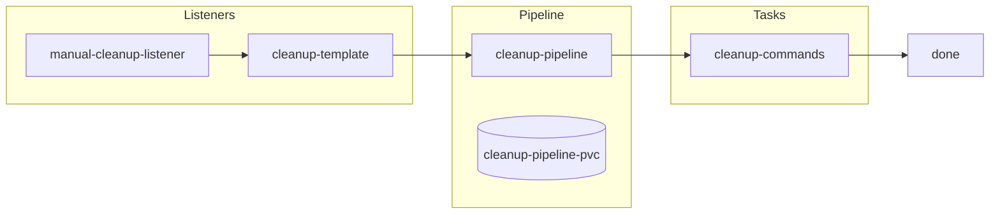

# Pipelines

## Main

_Triggered automatically after the toolchain is created, it deploys the infrastructure using Schematics, builds a container image and deploys the application on the provisioned cluster._

## Cleanup

_Triggered manually, it deletes the provisioned resources._

